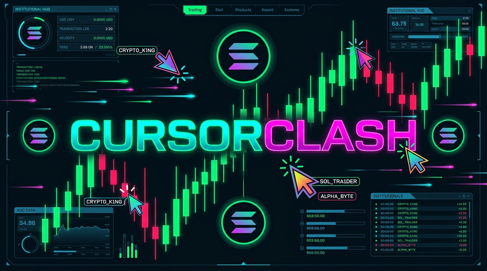
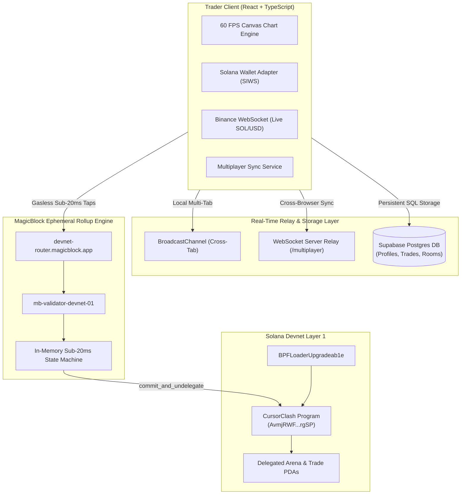

<p align="center">
  
</p>

<div align="center">

# ⚡ CursorClash: Real-Time Multiplayer Solana Trading Protocol

**High-Frequency Candlestick Tap-Trading on Solana & MagicBlock Ephemeral Rollups**

[](https://explorer.solana.com/address/AvmjRWFevdy6WK7D2towMreTFtMKijCGEKMSK7j9rgSP?cluster=devnet)
[](https://magicblock.gg)
[](https://supabase.com)
[](#-key-technical-capabilities)
[](https://www.typescriptlang.org)
[](./LICENSE)

</div>

---

## ⚡ Executive Summary

**CursorClash** is a decentralized, high-frequency multiplayer tap-trading protocol built on the Solana blockchain and MagicBlock Ephemeral Rollups. 

Traditional decentralized perpetual exchanges require traders to fill out complex order forms, execute manual confirmations, and endure 400ms base-layer latency per order. CursorClash fundamentally transforms market execution by turning the candlestick chart into an interactive, real-time multiplayer canvas. 

Traders visually observe peer positions streaming across live candlestick charts at **60 FPS**. Positions can be opened instantly by clicking directly on live price wicks to plant **Long** and **Short** trigger flags with leverage. Every action is synchronized peer-to-peer with **sub-20ms execution** and **zero gas fees** inside the rollup, before settling atomically on Solana L1.

---

## 🌟 Key Technical Capabilities

### 1. 60 FPS Candlestick & Peer Synchronization Mesh
* **Real-Time Canvas Engine**: High-frequency HTML5 Canvas rendering pipeline delivering 60 FPS rendering across high-DPI displays.
* **Dual-Layer Synchronization**:
  * **BroadcastChannel**: Zero-latency cross-tab and cross-window state replication for local sessions.
  * **WebSocket Relay**: Integrated room broker managing cross-network peer synchronization for cursor positions, tap flags, copy-trades, and reactions.
* **Real-Time Solana Market Feed**: Subscribes directly to Binance WebSocket streams (`solusdt@ticker` and `solusdt@kline_1s`) for genuine live tick updates and synchronized 1-minute candlestick bars.

### 2. MagicBlock Ephemeral Rollup Integration
* **Anchor Ephemeral Program**: Program accounts are delegated to MagicBlock's specialized rollup validators using the `#[delegate]` macro.
* **Sub-20ms Gasless Execution**: Tap-to-trade mutations execute in off-chain ephemeral validator state machines without consuming player transaction fees.
* **Cryptographic L1 Settlement**: When positions resolve or sessions conclude, state transitions are cryptographically committed back to the Solana L1 ledger using `commit_and_undelegate_accounts()`.

### 3. Non-Custodial Web3 Wallet Authentication
* **Standard Wallet Integration**: Direct support for **Phantom**, **Solflare**, and **Backpack** browser extensions.
* **Sign-In with Solana (SIWS)**: Cryptographic signature verification establishing authenticated player sessions.
* **Instant Devnet Keypair**: Built-in cryptographic keypair generation for testing environments, accompanied by automated 1-click Devnet faucet funding (+1 SOL).
* **Live Balance Listener**: Real-time balance monitoring via `@solana/web3.js` WebSocket `connection.onAccountChange`.

### 4. Room-Based Canvas Isolation & Private Squads
* **Isolated Trading Rooms**: Distinct trading arenas (`SOL/USDC 100X Wicks`, `BONK Volatility Arena`, `Global Trading Hub`) maintain completely separate candlestick canvases, order books, and cursor meshes.
* **Private Squad Generation**: Traders can generate custom private rooms with optional passcodes and shareable URLs (`?room=<id>`) to trade privately with squad members.

### 5. Persistent SQL Storage with Supabase
* **Profile Records**: Tracks lifetime player addresses, avatars, display names, and accumulated performance.
* **Trade Audit Logs**: Records trade order inputs (timestamp, room, direction, target price, leverage, stake, resolution status).
* **Global Leaderboard**: Live SQL queries rank top traders globally by net realized PnL and consecutive win streaks.

---

## 🏛️ System Architecture



---

## 📜 On-Chain Smart Contract Details

The smart contract is deployed, rent-exempt, and active on **Solana Devnet**:

```yaml
Program ID:          AvmjRWFevdy6WK7D2towMreTFtMKijCGEKMSK7j9rgSP
ProgramData Address: NdPtCUwAKkN7YDStUW6GgeV9vtiJrTd8RYBdrdFGwXg
Owner:               BPFLoaderUpgradeab1e11111111111111111111111
Deployer Authority:  3azzbKB2FBqNjwd6HVnz1vjcqfA2whrj8SeaMVYBEfE6
Deployment Slot:     496177718
Data Size:           319,344 bytes
Rent Balance:        1.62314636 SOL
Status:              Active (Executable)
```

### Blockchain Explorer Verification

* **Solana Explorer (Devnet):**  
  [https://explorer.solana.com/address/AvmjRWFevdy6WK7D2towMreTFtMKijCGEKMSK7j9rgSP?cluster=devnet](https://explorer.solana.com/address/AvmjRWFevdy6WK7D2towMreTFtMKijCGEKMSK7j9rgSP?cluster=devnet)

* **SolanaFM Explorer (Devnet):**  
  [https://solana.fm/address/AvmjRWFevdy6WK7D2towMreTFtMKijCGEKMSK7j9rgSP?cluster=devnet-solana](https://solana.fm/address/AvmjRWFevdy6WK7D2towMreTFtMKijCGEKMSK7j9rgSP?cluster=devnet-solana)

---

## 📁 Repository Structure

```
CursorClash/
├── banner.png                     # Protocol Header Banner Asset
├── public/
│   ├── banner.png                 # Publicly accessible banner asset
│   └── favicon.svg                # Protocol vector favicon
├── programs/
│   └── cursorclash/               # Rust / Anchor Smart Contract
│       ├── Cargo.toml             # Pinned Rust 2021 crate dependencies
│       └── src/
│           └── lib.rs             # MagicBlock #[ephemeral], #[delegate], #[commit] logic
├── src/
│   ├── components/
│   │   ├── ArenaApp.tsx           # Primary trading arena container with room layout
│   │   ├── Homepage.tsx           # Institutional landing interface and room selection
│   │   ├── Leaderboard.tsx        # Supabase-backed live rankings
│   │   ├── Navbar.tsx             # Wallet status, balance, airdrop faucet, theme controls
│   │   ├── PrivateRoomModal.tsx   # Custom private room generation and link sharing
│   │   ├── QuickOrderPanel.tsx    # Tap long / tap short order entry terminal
│   │   ├── RollupTelemetryModal.tsx # Live Ephemeral Rollup diagnostics & explorer links
│   │   ├── TradeTape.tsx          # Real-time transaction feed
│   │   ├── TradingCanvas.tsx      # 60 FPS candlestick canvas and peer cursor mesh
│   │   └── WalletModal.tsx        # Phantom, Solflare, Backpack, and Burner selector
│   ├── lib/
│   │   ├── magicblock.ts          # MagicBlock Ephemeral Rollup integration service
│   │   ├── multiplayer.ts         # Room-isolated real-time synchronization service
│   │   ├── onchain.ts             # Direct Solana Devnet contract RPC caller
│   │   ├── priceFeed.ts           # Binance WebSocket live Solana market ticker & candles
│   │   ├── solana.ts              # Web3 wallet manager, SIWS, balance monitoring
│   │   ├── supabase.ts            # Supabase database client and data access service
│   │   └── theme.tsx              # Clean light / dark mode state management
│   ├── App.tsx                    # Root routing and modal coordinator
│   ├── index.css                  # High-contrast color tokens and design system
│   └── main.tsx                   # React 19 entry point
├── Anchor.toml                    # Anchor project configuration
├── package.json                   # Dependencies & build scripts
├── tsconfig.json                  # TypeScript compiler settings
└── vite.config.ts                 # Vite setup with native WebSocket multiplayer relay
```

---

## 🚀 Getting Started

### Prerequisites

* **Node.js**: v18.0.0 or later
* **Package Manager**: `npm` or `pnpm`
* **Browser**: Chrome, Brave, Edge, or Firefox with Phantom, Solflare, or Backpack extension (optional, as built-in keypairs are supported).

### Installation & Local Execution

1. **Clone the repository and navigate into the project directory:**
   ```bash
   git clone https://github.com/sandman-sh/CursorClash.git
   cd CursorClash
   ```

2. **Install dependencies:**
   ```bash
   npm install
   ```

3. **Configure environment variables (optional):**
   ```bash
   cp .env.example .env
   ```

4. **Start the local development server with integrated WebSocket relay:**
   ```bash
   npm run dev
   # Or on Windows PowerShell:
   npm.cmd run dev
   ```

5. **Access the application:**
   Open [http://localhost:5173/](http://localhost:5173/) (or the port specified in terminal output).

---

## 🧪 Testing the Multiplayer Mesh

To verify real-time peer interactions:

1. Open **Window A** at `http://localhost:5173/`.
2. Connect your wallet using **Phantom**, **Solflare**, or **Instant Devnet Keypair**.
3. Open **Window B** in an incognito or separate browser session at `http://localhost:5173/`.
4. Connect a second wallet or generate another instant Devnet keypair.
5. In Window A, move your cursor across the candlestick chart: **Window B will immediately render Window A's cursor with its shortened public key and avatar in real-time**.
6. In Window A, click anywhere on the chart or click **TAP LONG**:
   - The flag appears instantly on Window A's canvas.
   - The flag appears simultaneously on Window B's canvas and in the **Live Trade Tape**.
   - Window B can click on Window A's flag to execute a **1-Click Copy Trade**.
7. As the live SOL market price ticks via WebSocket, crossing the flag target triggers instant resolution with Win/Loss PnL calculations and celebratory confetti.

---

## 🛡️ Security & Auditing

* **Non-Custodial Architecture**: Private keys never leave the user's browser or wallet extension.
* **Row-Level Security (RLS)**: Supabase PostgreSQL database tables enforce granular row-level policies.
* **Ephemeral Rollup Isolation**: State transitions inside the rollup are validated cryptographically against Anchor instruction constraints before committing to Solana L1.

---

## 📄 License

This project is open-source software licensed under the [MIT License](./LICENSE).
